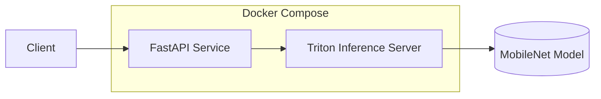

# 프로젝트 README

## 개요
이 프로젝트는 FastAPI와 Triton Inference Server를 사용하여 MobileNet 모델로 이미지 분류를 수행합니다.
`docker-compose`를 통해 컨테이너로 실행하며, 클라이언트 요청을 FastAPI에서 처리하고 Triton 서버를 통해 추론 결과를 반환합니다.



## 프로젝트 구조
```
.
├── app/
│   ├── api/
│   │   ├── routes.py          # FastAPI 라우터
│   │   └── schemas.py         # Pydantic 모델
│   ├── services/
│   │   └── inference.py       # Triton 클라이언트 서비스
│   └── main.py                # FastAPI 애플리케이션
├── model_repository/
│   └── mobilenet/
│       ├── config.pbtxt       # 모델 설정
│       └── 1/
│           └── model.onnx     # ONNX 모델 파일
├── docker/
│   └── Dockerfile.triton      # Triton 서버 Dockerfile
├── Dockerfile                  # FastAPI 서비스 Dockerfile
├── docker-compose.yml          # 컨테이너 구성
└── pyproject.toml              # Poetry 의존성 관리
```

## 실행 방법

### 1. 서비스 빌드 및 시작
```bash
docker compose up --build
```

### 2. 로그 확인
```bash
docker compose logs -f
```

### 3. 컨테이너 상태 확인
```bash
docker compose ps
```

### 4. Triton 서버 상태 확인
```bash
curl -v localhost:8000/v2/health/ready
```

### 5. Python 테스트 스크립트 실행
```bash
python test_inference.py
```

### 6. cURL로 테스트
```bash
curl -X POST -F "file=@./truck.png" http://localhost:8080/api/v1/predict
```

### 7. 컨테이너 종료
```bash
docker-compose down
```

### 8. 컨테이너, 이미지, 볼륨 모두 제거
```bash
docker-compose down --rmi all -v
docker system prune -a
```

## Triton 설정 파일 (config.pbtxt)
```protobuf
name: "mobilenet"
platform: "onnxruntime_onnx"
max_batch_size: 8
input [
  {
    name: "input"
    data_type: TYPE_FP32
    dims: [ 3, 224, 224 ]
  }
]
output [
  {
    name: "output"
    data_type: TYPE_FP32
    dims: [ 1000 ]
  }
]
```

## API 응답 예시
```json
{
  "class_id": 123,
  "class_name": "truck",
  "confidence": 0.95
}
```

## 디버깅 및 로그 확인

### 1. Triton 서버 로그 확인
```bash
docker compose logs triton
```

### 2. FastAPI 로그 확인
```bash
docker compose logs api
```

### 3. Triton 서버 에러 로그 확인
```bash
docker compose logs triton | grep "error"
```

### 4. 모델 저장소 권한 확인
```bash
ls -l model_repository/
```

### 5. Docker 네트워크 확인
```bash
docker network ls
docker network inspect triton_inference_test_triton_network
```

---


